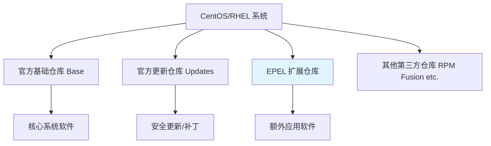

## sudo yum install epel-release -y

为什么linux上 要安装 这个呢， 这个作用是干嘛的


非常好问题！`epel-release` 在 CentOS/RHEL 系统中扮演着非常重要的角色。让我详细解释它的作用：

## **EPEL 是什么？**

**EPEL** = **E**xtra **P**ackages for **E**nterprise **L**inux

- 这是由 **Fedora 社区**维护的一个高质量软件仓库
- 专门为 **RHEL、CentOS、Rocky Linux** 等企业级 Linux 发行版提供额外的软件包
- 可以理解为 **"官方认证的扩展软件商店"**

## **为什么需要安装 EPEL？**

### **1. 解决官方源软件包不足的问题**
企业级 Linux（如 CentOS/RHEL）的**官方软件仓库非常保守**：
- 只包含最稳定、最经过测试的软件
- 版本通常比较旧
- 软件数量有限

**没有 EPEL 时：**
```bash
# 尝试安装一些常见软件可能会失败：
sudo yum install htop          # 找不到包
sudo yum install nginx         # 找不到包  
sudo yum install wireguard     # 找不到包
```

**安装 EPEL 后：**
```bash
# 这些软件都可以安装了！
sudo yum install htop          # 系统监控工具
sudo yum install nginx         # Web服务器
sudo yum install wireguard     # VPN软件
```

### **2. 软件包质量有保障**
- EPEL 中的软件包都经过严格测试
- 与系统其他组件兼容性好
- 有安全更新和维护

## **EPEL 包含哪些常用软件？**

| 软件类别 | 具体软件 | 用途 |
|----------|----------|------|
| **开发工具** | `git`, `python3-pip`, `nodejs` | 编程开发 |
| **系统工具** | `htop`, `iotop`, `iftop` | 系统监控 |
| **网络工具** | `nginx`, `haproxy`, `wireguard` | 网络服务 |
| **数据库** | `mongodb`, `redis` | 数据库 |
| **其他** | `ffmpeg`, `tmux`, `unrar` | 多媒体、工具 |

## **EPEL 与其他软件源的关系**



## **实际使用示例**

### **安装 EPEL：**
```bash
# CentOS 7/RHEL 7:
sudo yum install epel-release -y

# CentOS 8/RHEL 8/Rocky Linux:
sudo dnf install epel-release -y
```

### **安装 EPEL 后可以做什么：**
```bash
# 安装系统监控工具
sudo yum install htop iotop iftop -y

# 安装开发工具
sudo yum install git python3-pip -y

# 安装网络工具
sudo yum install nginx wireguard-tools -y

# 查看 EPEL 提供了哪些包
yum --disablerepo="*" --enablerepo="epel" list available
```

## **重要注意事项**

### **1. 优先级问题**
- EPEL 的软件包**不会覆盖**官方仓库的包
- 如果同一个软件在官方仓库和 EPEL 都存在，默认使用官方版本

### **2. 安全性**
- EPEL 是**受信任的源**，比随便添加的第三方仓库安全得多
- 软件包都有 GPG 签名验证

### **3. 替代方案**
对于某些软件，你可能还需要其他仓库：
- **RPM Fusion**：提供多媒体相关的软件（如视频解码器）
- **Remi仓库**：提供更新的 PHP 版本

## **为什么 WireGuard 需要 EPEL？**

在企业级 Linux 中：
- WireGuard 是一个相对较新的技术
- 没有包含在官方保守的仓库中
- 但包含在 EPEL 中，因为社区认识到它的价值

```bash
# 没有 EPEL：无法安装 WireGuard
sudo yum install wireguard-tools
# 错误：没有可用软件包 wireguard-tools

# 有 EPEL：可以顺利安装
sudo yum install epel-release -y
sudo yum install wireguard-tools -y
# 成功安装！
```

## **总结**

**`sudo yum install epel-release -y` 的作用就是：**
为你的企业级 Linux 系统**开启一个官方认证的扩展软件商店**，让你能够安装那些在官方保守仓库中不包含的、但又非常实用的软件包。

这就像是给你的系统安装了一个"应用商店扩展包"，大大丰富了可用软件的选择！

